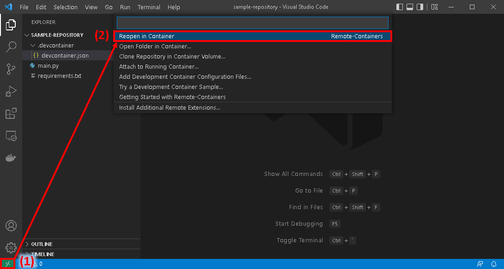
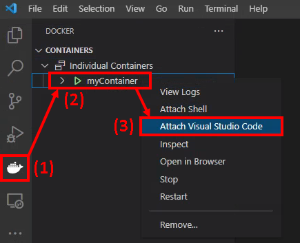

# Slurm in Docker

### Docker images with Slurm Workload Manager installed

This repository contains setup files for Ubuntu-based Docker images and containers with the [Slurm Workload Manager](https://slurm.schedmd.com/) installed.  These images are primarily designed to serve as an environment to experiment with Slurm or run unit/integration tests of code that will later be run on high-performance computing (HPC) resources.


## Image Descriptions and Tags

This repository contains files which can be used to configure Docker images with Slurm installed.  Two image versions are provided:
- A "base" version with Slurm installed and a minimal set of required packages
- A "full" version with everything in the base version, plus various system tools (Python, text editors, Git, GCC, etc.) meant to reflect the basic setup of typical HPC servers

Both image versions are configured such that the default user is either `root` (if the tag has "root" in the name) or a standard user with sudo privileges.

### Docker Hub repository: https://hub.docker.com/r/nathanhess/slurm

| Tag       | Base Image                                | Build Context      | Default User |  
|:----------|:------------------------------------------|:-------------------|:-------------|
| base      | [Ubuntu](https://hub.docker.com/_/ubuntu) | `dockerfile_base/` | standard     |
| base-root | [Ubuntu](https://hub.docker.com/_/ubuntu) | `dockerfile_base/` | root         |
| full      | [Ubuntu](https://hub.docker.com/_/ubuntu) | `dockerfile_full/` | standard     |
| full-root | [Ubuntu](https://hub.docker.com/_/ubuntu) | `dockerfile_full/` | root         |

> **Note**: For the images with a standard user, the default username is `docker` and the default password is `ubuntu`.

### GitHub repository: https://github.com/nathan-hess/docker-slurm

Dockerfiles and other configuration files for these images are stored in GitHub.  The images are automatically built and published to [Docker Hub](https://hub.docker.com/) with a GitHub Actions workflow.  The workflow runs twice a month, in addition to any time a change is made to the `Dockerfile` for either image, the workflow file itself, or configuration files (`.env`).


---

## Introduction to Docker

Docker is a platform designed for setting up and running containers.  On a high level, containers bundle software, files, and system configuration options into a single, distributable environment.

From Docker's [official documentation](https://docs.docker.com/get-started/overview/):
> Docker provides the ability to package and run an application in a loosely isolated environment called a container. [...] Containers are lightweight and contain everything needed to run the application, so you do not need to rely on what is currently installed on the host. You can easily share containers while you work, and be sure that everyone you share with gets the same container that works in the same way.

Containers in many ways function similar to a virtual machine: you can install required dependencies, set configuration options, and define environment variables inside a container, and then share the container to any other system to reproduce a nearly identical environment.  However, it is important to note that containers and virtual machines are NOT equivalent, and each has their own capabilities and limitations.

Some of the advantages of containers include:

- **Bundled dependencies**: Setting up a development environment or dependencies required to run an application often involves many manual steps.  These steps can become time-consuming and tedious if performed manually on a per-system basis.  However, if instead all dependencies are installed in a container, then the container can simply be transferred to different systems, and all dependencies and configuration will be transferred with it.  This makes it extremely easy to set up and run your code on different systems.
- **Reproducibility**: Using containers allows you to run your code with identical dependency versions and system configuration, so the same code should behave identically on different machines.
- **Ability to install software without administrator privileges**: In many cases, you may not have administrator privileges on computing systems such as HPC clusters, but you may need certain dependencies that require administrator privileges to install.  Many HPC clusters offer container software that provides a workaround: simply install your software in a container, and then you can transfer the container to the HPC cluster and run all required dependencies without administrator privileges.

For a list of useful Docker commands, refer to the [Docker Command-Line Reference](https://docs.docker.com/engine/reference/commandline/docker/).


## Usage Instructions

### Prerequisites

To use the images in this repository, ensure that you have first completed the following steps:
- Installed [Docker Desktop](https://docs.docker.com/desktop/)
- Installed [Visual Studio Code](https://code.visualstudio.com/docs/setup/setup-overview) (VS Code)
  - Within VS Code, install the [Docker](https://marketplace.visualstudio.com/items?itemName=ms-azuretools.vscode-docker) and [Remote - Containers](https://marketplace.visualstudio.com/items?itemName=ms-vscode-remote.remote-containers) extensions
- If you want to build images locally or customize the images, also [clone this repository](https://docs.github.com/en/repositories/creating-and-managing-repositories/cloning-a-repository) to your local system

Note that the instructions in this section were developed and tested on devices running Windows 10 and Ubuntu 20.04 as root.  Issues can sometimes be encountered if using Docker on Linux systems in [rootless mode](https://docs.docker.com/engine/security/rootless/); in these cases it is advised to either use one of the [`root` images](#docker-hub-repository-httpshubdockercomrnathanhessslurm) or run Docker as root.

> **Important**: The standard user images by default use the username and password posted publicly in this repository.  If security is of significant concern, it is recommended that you change the password by running `passwd` after starting the container.

### Try it Out!

To pull and run a container to quickly test it out and experiment with Slurm, first pull the image from Docker Hub:

`docker pull nathanhess/slurm:[TAG]`

Then start a container:

`docker run --rm -it nathanhess/slurm:[TAG]`

Where `[TAG]` is selected from the table [above](#docker-hub-repository-httpshubdockercomrnathanhessslurm).

### Docker Compose

A number of options must be configured to build the Docker images in this repository.  This repository contains a [Docker Compose](https://docs.docker.com/compose/) configuration file `docker-compose.yml` that can streamline this process.

To use Docker Compose, open a terminal in the root of the repository.  Then, run one of the following commands, depending on your use case:

| Use Case                                      | Image Source         | Command                            |
|:----------------------------------------------|:---------------------|:-----------------------------------|
| Basic testing in terminal                     | Pull from Docker Hub | `docker compose run [TAG]`         |
| Create detached container                     | Pull from Docker Hub | `docker compose up -d [TAG]`       |
| Build image locally                           | Build locally        | `docker compose build build-[TAG]` |
| Remove containers created with Docker Compose | N/A                  | `docker compose down`              |

Where `[TAG]` is selected from the table [above](#docker-hub-repository-httpshubdockercomrnathanhessslurm).

Many additional options can be configured in `docker-compose.yml`.  Refer to the [Docker Compose reference](https://docs.docker.com/compose/) for further information.

### Visual Studio Code Development Containers

VS Code can be [run inside a container](https://code.visualstudio.com/docs/remote/containers), thus using the container as a development environment with access to the full range of VS Code capabilities.  This provides a useful application of the images inside this repository, allowing rapid testing of code that interfaces with Slurm.

#### devcontainer.json

The recommended way to use the images in this repository as a VS Code development container is by creating a `devcontainer.json` file.  This file allows a [sizeable number of options](https://code.visualstudio.com/docs/remote/devcontainerjson-reference) (hostname, which folders on the host system are mounted in the container, commands to run after creating the container, etc.) to be configured.

To use a `devcontainer.json` file for one of your projects, first navigate to the root directory of your project repository.  Create a folder `.devcontainer/` and inside this folder, create a JSON file named `devcontainer.json`.  You can add any desired [configuration options](https://code.visualstudio.com/docs/remote/devcontainerjson-reference) to the `devcontainer.json` file you created.  However, at minimum, the following options must be set:

| Key                  | Image Default User | Value                      |
|:---------------------|:-------------------|:---------------------------|
| `"image"`            | both               | `"nathanhess/slurm:[TAG]"` |
| `"overrideCommand"`  | both               | `true`                     |
| `"postStartCommand"` | standard           | `"sudo /etc/startup.sh"`   |
| `"postStartCommand"` | root               | `"/etc/startup.sh"`        |

Where `[TAG]` is selected from the table [above](#docker-hub-repository-httpshubdockercomrnathanhessslurm).

After setting up the `devcontainer.json` file, simply select the "Reopen in Container" option from the [Remote - Containers](https://marketplace.visualstudio.com/items?itemName=ms-vscode-remote.remote-containers) extension as illustrated below.



A sample `devcontainer.json` file is shown below.  This sample file illustrates how to set a desired container hostname, avoid Git "unsafe directory" errors, and install pip dependencies inside the container.

```
{
    "image": "nathanhess/slurm:full",
    "runArgs": ["--hostname=linux"],
    "overrideCommand": true,
    "postCreateCommand": "git config --global --add safe.directory ${containerWorkspaceFolder}",
    "postStartCommand": "sudo /etc/startup.sh",
    "postAttachCommand": "pip install -r ${containerWorkspaceFolder}/requirements.txt"
}
```

#### Attach to a Running Container

An alternative way to open VS Code in a Docker container without using a `devcontainer.json` file is to first create a *detached* container, either using Docker Compose as described [above](#docker-compose) or with `docker run -d`.

Then, as shown in the image below, open VS Code and navigate to the Docker extension menu.  The detached container you created should appear.  Right-click it and choose "Attach Visual Studio Code."



### GitHub Actions

Another application of the images in this repository is running automated code testing that invokes Slurm commands, through a platform such as GitHub Actions.  To run GitHub Actions workflows in one of the images in this repository, simply set the value of `jobs.<job_id>.container.image` to the desired Docker Hub repository and tag as illustrated below:

```
jobs:
  build:
    name: Job Name
    runs-on: ubuntu-latest
    container:
      image: nathanhess/slurm:[TAG]
```

Where `[TAG]` is selected from the table [above](#docker-hub-repository-httpshubdockercomrnathanhessslurm).  Also make sure to run `sudo /etc/startup.sh` (for standard user images) or `/etc/startup.sh` (for root user images) if you override the default entrypoint for the container.

For more information, refer to the [GitHub Actions documentation](https://docs.github.com/en/actions/using-jobs/running-jobs-in-a-container).


## Project History, Capabilities, and Limitations

This project began in March 2022 to solve a challenge in a code development project seeking to develop Python scripts to interact with Slurm.  While developing the code, it was necessary to repeatedly run Slurm commands for testing, but access to HPC systems often incurs financial costs and requires waiting in queues, slowing down the development process.  How could code invoking Slurm commands be tested rapidly and at no financial cost?

The answer was to use Docker containers.  This provides several benefits:
- As discussed in the [Introduction to Docker](#introduction-to-docker) section, Docker containers are lightweight, reproducible, and easily set up and removed -- conducive to code testing.
- Visual Studio Code has built-in mechanisms to set up Docker-based [development containers](https://code.visualstudio.com/docs/remote/containers), facilitating rapid code development, without the need to test code on HPC systems.
- GitHub Actions allows workflows to be [run in custom Docker containers](https://docs.github.com/en/actions/using-jobs/running-jobs-in-a-container), facilitating automated code testing.

That said, as with any project, there are important limitations to be aware of:
- These images have a relatively basic Slurm setup.  They do not use Slurm configuration features such as cgroups or a job accounting database.
- These images define a single-node setup.  However, they could be relatively easily extended to a multi-node cluster through Docker Compose or Kubernetes.

If extending the existing Docker image configurations to overcome any of the above limitations would benefit your work, please [submit a feature request](https://github.com/nathan-hess/docker-slurm/issues/new?labels=enhancement&template=feature_request.md).


## References

- [Slurm](https://slurm.schedmd.com/)
  - [Official Project Documentation](https://slurm.schedmd.com/)
  - [SUSE Slurm Setup Guide](https://documentation.suse.com/sle-hpc/15-SP3/html/hpc-guide/cha-slurm.html)
- [Docker](https://www.docker.com/)
  - [Getting Started Overview](https://docs.docker.com/get-started/overview/)
  - [Command-Line Reference](https://docs.docker.com/engine/reference/commandline/docker/)
  - [Dockerfile Reference](https://docs.docker.com/engine/reference/builder/)
- [Docker Compose](https://docs.docker.com/compose/)
  - [Compose File Reference](https://docs.docker.com/compose/compose-file/)
- [Visual Studio Code](https://code.visualstudio.com/)
  - [Developing Inside a Container](https://code.visualstudio.com/docs/remote/containers)
  - [Attach to a Container](https://code.visualstudio.com/docs/remote/attach-container)
  - [Creating a Development Container](https://code.visualstudio.com/docs/remote/create-dev-container)
  - [devcontainer.json File Reference](https://code.visualstudio.com/docs/remote/devcontainerjson-reference)
- [GitHub Actions](https://docs.github.com/en/actions)
  - [Running jobs in a container](https://docs.github.com/en/actions/using-jobs/running-jobs-in-a-container)
